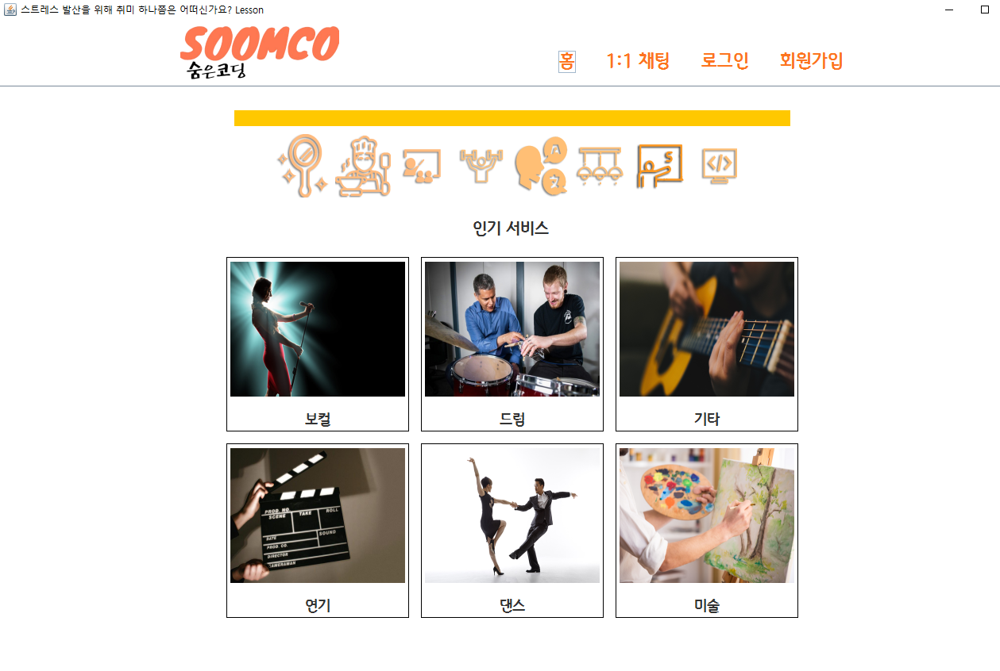

# Java GUI(Swing) Team Project(2020.11 ~ 2020.12) SoomCo

## 1.프로젝트 개요

>1. 해당 프로젝트는 자바 기초를 이해하기 위함과 JDBC를 이용하여 Oracle SQL 기초를 공부하는데에 의미가 있다. 
>2. Java GUI 클래스인 Swing의 기초를 이해하며 Jsoup API를 이용하여 웹 크롤링 및 필요 데이터를 추출한다. 
>3. 기존에 존재하는 웹 사이트인 '숨고(숨은고수)'를 참고하여 회원관리, 1:1채팅, 로그인 여부에 따른 기능제한 등을 구현한다.

## 2. 프로젝트 자원

>+ 인력 : 4인
>+ 기간 : 약 3주(평일 09-18시 이후)
>+ SW : Oracle 11g XE, JDK 1.8, Jsoup 1.14
>+ 기타 정적 자원 : Free PNG Format Image & 직접 디자인, Free Font

## 3. 프로젝트 수행흐름

>1. 아이디어 구상 및 컨셉 회의
>2. 필수 기능 정리 및 화면 설계
>3. 역할별 업무 분담
>4. 역할별 업무 수행
>><ol> 4.1 디자인 및 필요 자원 수집(Image, Font 등) </ol>
>><ol> 4.2 DB 구축(TableSpace, User, Table, JDBC 설정 등) [본인] </ol>
>><ol> 4.3 기능 구현(화면, CRUD, 페이지 전환, 웹 크롤링, 1:1채팅 등) [본인 일부] </ol>
 
## 4. 프로젝트 결과
>### 메인 화면

>### 메인 화면 버튼 구성(=클릭 이벤트 존재 컴포넌트)

>### 매거진 버튼 클릭 시 웹 페이지 출력

>### 상단 좌측 카테고리 8개 버튼 클릭 시 페이지 전환

>### 상단 홈, 로그인, 회원가입 버튼 클릭 시 페이지 전환 (1:1채팅은 견적서 이후)
>>
>>#### 홈
>>>

>>#### 로그인
>>>

>>#### 회원가입
>>>

>### 초보로 로그인 후, 견적서 제출(초보-고수 매칭을 위해 초보가 원하는 카테고리에서 내용 작성)
>>
>>#### 카테고리 중 원하는 종류 클릭
>>>

>>#### 견적서 내용 작성
>>>

>>#### 견적서 제출 후, 임시 1:1 채팅방 생성(채팅내용 자동생성)
>>>

>>#### 매칭하기 클릭 시 해당 카테고리에 소속된 고수들중 랜덤하게 매칭되어 1:1 채팅방이 생성되며 멘티:멘토 관계가 형성
>>>

>### 견적서 제출 후, 매칭된 고수와의 1:1 채팅(채팅방 타이틀에 접속한 유저명 표시)
>>
>>#### 매칭된 고수의 1:1 채팅방에 견적서 내용이 작성되어 있으며, 1:1 채팅이 가능
>>>
>>>
>>>
>>>

>>#### 한 번 매칭이 이루어지면 고수는 계약기간까지 임의로 해지할 수 없으며, 초보만이 조기종료가 가능
>>>
